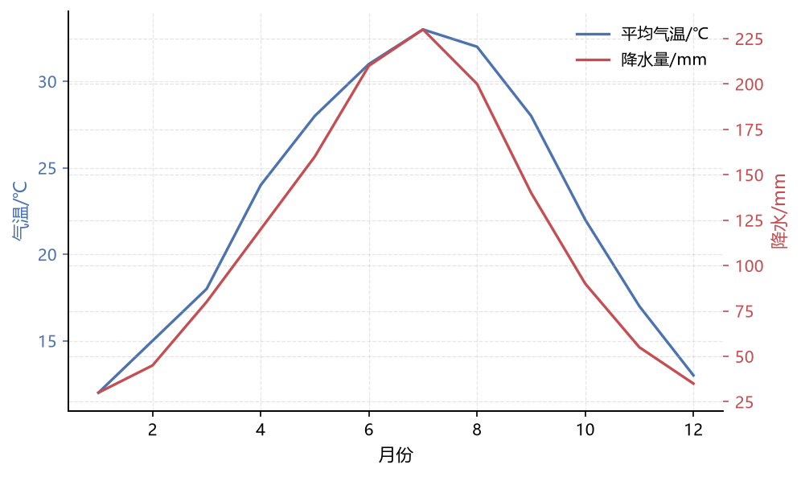
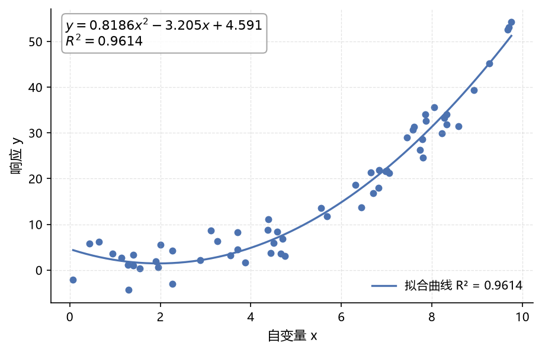
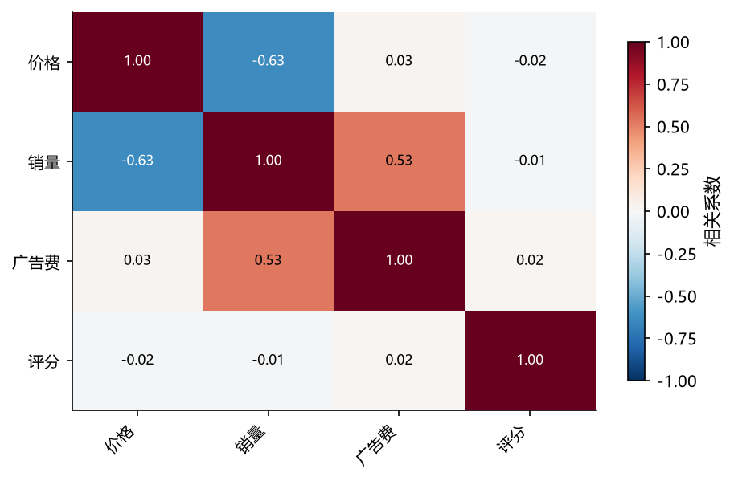
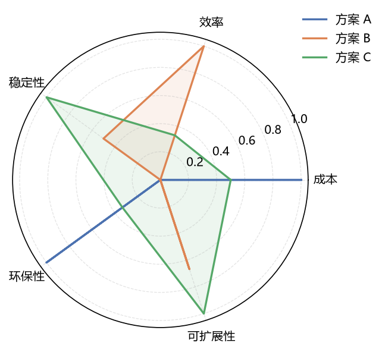
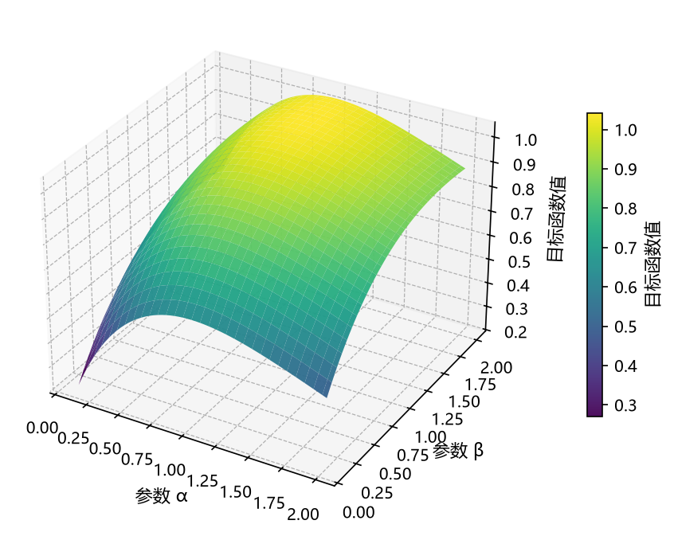
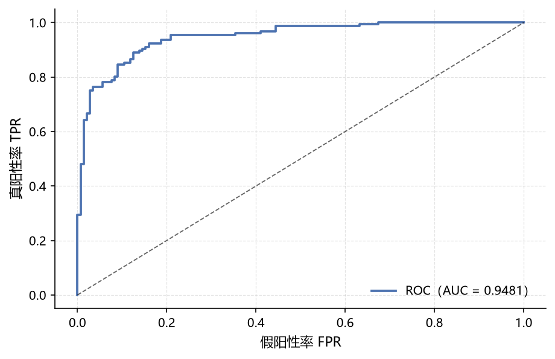
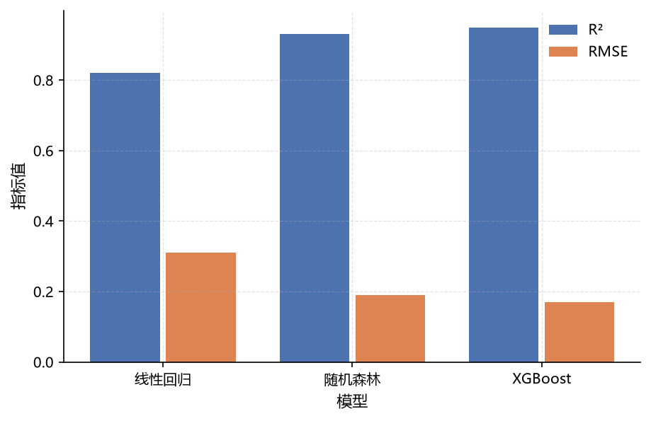
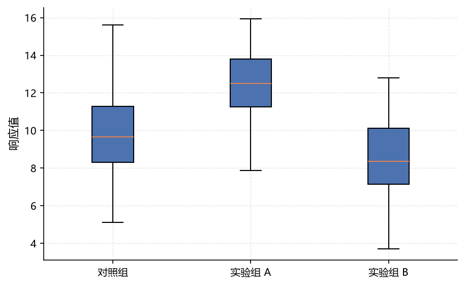

# 论文绘图 plotting

绘图模块的目标只有一个：**让你少写 50 行 matplotlib 样板代码，出的图直接能进论文**。

三条核心约定：

1. **`save="图名"` 一步到位** —— 保存为 `figures/图名.pdf`（矢量），
   同时把作图数据写到 `code/outputs/figure_data/图名.csv`，数值来源可追溯。
2. **不在图里写标题** —— 标题交给论文 caption（这是本工作区的规范）。
3. **中文自动就绪** —— 只要调用过 `pm.init()`，字体、负号、配色都不用管。

## 图画廊

=== "双轴折线"

    ```python
    fig, ax, ax2 = pm.dual_axis(
        months, temperature, rainfall,
        labels=("平均气温/℃", "降水量/mm"), xlabel="月份",
    )
    ```

    

=== "散点 + 拟合"

    ```python
    fig, ax, info = pm.scatter_fit(x, y, degree=2,
                                   xlabel="自变量 x", ylabel="响应 y")
    print(info)   # {"coef": [...], "r2": 0.9614, "rmse": ...}
    ```

    

=== "相关矩阵热力图"

    ```python
    fig, ax = pm.corr_heatmap(df)     # 相关系数，固定 -1~1 色阶
    ```

    

=== "雷达图"

    ```python
    fig, ax = pm.radar(
        ["成本", "效率", "稳定性", "环保性", "可扩展性"],
        {"方案 A": [...], "方案 B": [...], "方案 C": [...]},
        normalize=True,               # 指标量纲不同，自动归一化
    )
    ```

    

=== "三维曲面"

    ```python
    fig, ax = pm.surface3d(XX, YY, ZZ,
                           xlabel="参数 α", ylabel="参数 β", zlabel="目标函数值")
    ```

    

=== "ROC 曲线"

    ```python
    fig, ax, auc = pm.roc(y_true, y_score)
    ```

    

=== "分组柱状图"

    ```python
    fig, ax = pm.bar_group(labels, {"R²": [...], "RMSE": [...]})
    ```

    

=== "箱线图"

    ```python
    fig, ax = pm.box({"对照组": [...], "实验组 A": [...], "实验组 B": [...]})
    ```

    

## 函数速查

所有绘图函数都返回 `(fig, ax)`，都支持 `save=`、`xlabel/ylabel`、`figsize`、`ax=`（画到已有子图）。

| 函数 | 用途 |
| --- | --- |
| `line(x, ys, labels=[...])` | 折线；`ys` 支持多条曲线 |
| `scatter(x, y)` / `scatter_fit(x, y, degree)` | 散点 / 散点+拟合（返回 info） |
| `bar(labels, values, errors=None, orient="v")` | 柱状 / 条形（`orient="h"`）、误差棒 |
| `bar_group(labels, {系列名: 值列表})` | 分组柱状（模型、方案对比） |
| `hist(x, kde=True)` / `box({组名: 数据})` | 分布 |
| `heatmap(matrix, annot=False)` | 通用热力图；DataFrame 自动取行列名 |
| `corr_heatmap(df)` | 相关矩阵 |
| `radar(labels, {方案: 值})` | 雷达（多方案综合评价） |
| `dual_axis(x, y1, y2)` | 双纵轴 |
| `pie(labels, values)` / `errorbar(x, y, yerr)` | 占比 / 误差棒 |
| `surface3d(X, Y, Z)` | 三维曲面 |
| `roc(y_true, y_score)` | 二分类 ROC（返回 AUC） |
| `save_fig(fig, name, formats=("pdf",), data=None)` | 底层保存；`formats=("pdf","png")` 同时出预览图 |

## 进阶用法

```python
import matplotlib.pyplot as plt

# 需要精细控制时：拿回 fig/ax 继续改
fig, ax = pm.line(x, y, xlabel="t", ylabel="c")
ax.axvline(5, color="gray", ls=":")
ax.annotate("峰值", xy=(5, max(y)))
pm.save_fig(fig, "q2_peak", formats=("pdf", "png"), close=True)

# 多子图（matplotlib 原生 + 本库函数混用）
fig, axes = plt.subplots(1, 2, figsize=(10, 4))
pm.hist(residuals, ax=axes[0], xlabel="残差")
pm.scatter(y_test, y_pred, ax=axes[1], xlabel="真实值", ylabel="预测值")
pm.save_fig(fig, "q3_diagnostics")
```

!!! tip "图片格式"
    论文只认 `figures/` 下的 PDF；日常预览可以加
    `formats=("pdf", "png")`，或单独用 `pm.save_fig(..., formats=("png",))`。

!!! warning "保存后不要再动图"
    带 `save=` 的便捷函数保存后不会关闭图形；但如果你自行 `plt.close(fig)`，
    之后就不能再修改了。需要反复修改时请用 `ax=` 复用或先不 save。
